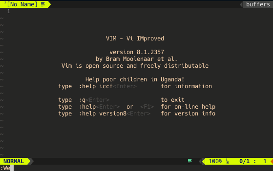

# Weather.vim

A plug-in that lets you know the weather in Japan with a single command.

# Requirement

[webapi-vim](https://github.com/mattn/webapi-vim)

If it is not installed, see below.

> https://github.com/mattn/webapi-vim

---

# Install

## Use dein.vim

```
call dein#add('kazukazuinaina/Weather.vim')
```

## Use vim-plug

```
Plug 'kazukazuinaina/Weather.vim'
```

# Usage

Simply run `:Weather` command

# 対応都市

- **Hokkaido**
- **Sendai**
- **Tokyo**
- **Nagoya**
- **Shiga**
- **Kyoto**
- **Osaka**
- **Hiroshima**
- **Hukuoka**

More cities will be added later

# screenshot



# Used Web Api

> http://weather.livedoor.com/weather_hacks/webservice

# Todo

- [ ] Add more city in japan
- [ ] Adopt global city
